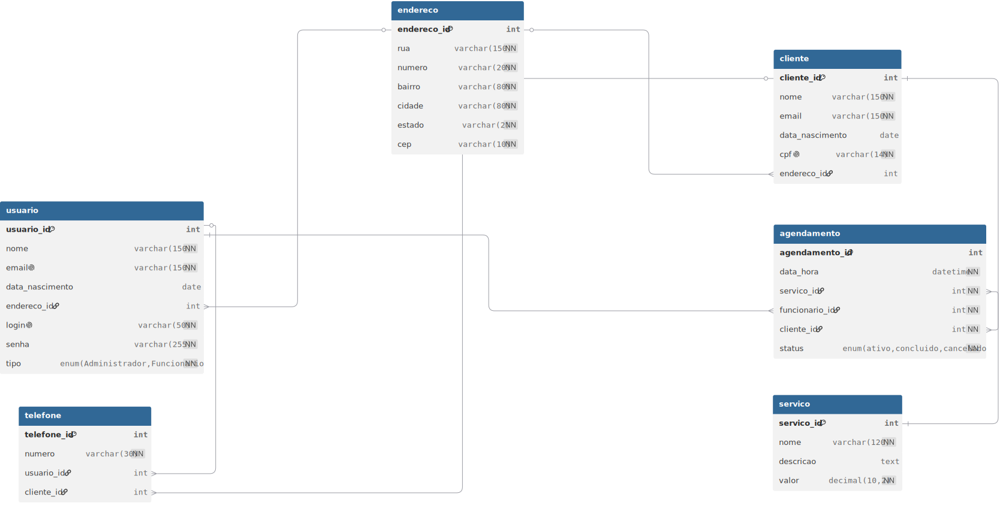

# 💈 Barbershop Database

<p align="center">
  
</p>

<p align="center">


</p>

A relational database project developed in **MySQL** for managing a barbershop's daily operations.

This project was created for the **Database** course of the **Bachelor's Degree in Software Engineering** at the **Federal University of Technology – Paraná (UTFPR)** under the supervision of **Prof. Eduardo Cotrin Teixeira**.

The project focuses on relational database modeling, implementation and querying while applying concepts such as normalization, referential integrity, primary and foreign keys, and SQL joins.

---

# 📑 Table of Contents

- [Overview](#-overview)
- [Features](#-features)
- [Database Model](#-database-model)
- [Entity Summary](#-entity-summary)
- [Project Structure](#-project-structure)
- [Getting Started](#-getting-started)
- [Implemented Queries](#-implemented-queries)
- [Database Concepts Applied](#-database-concepts-applied)
- [Possible Improvements](#-possible-improvements)
- [Authors](#-authors)
- [License](#-license)

---

# 📖 Overview

The objective of this project is to design and implement a relational database capable of managing the core operations of a barbershop.

The implemented solution stores information about customers, employees, addresses, services, phone numbers and appointments while ensuring data consistency through primary keys, foreign keys and relational constraints.

The database was modeled following relational database principles and implemented using MySQL.

---

# ✨ Features

- Customer registration
- Employee and administrator registration
- Address management
- Phone number management
- Service catalog
- Appointment scheduling
- Appointment status control
- SQL queries for data retrieval

---

# 🗄 Database Model

The Entity-Relationship Diagram below represents the complete database schema implemented in this project.

<p align="center">

</p>

---

# 📋 Entity Summary

| Entity | Description |
|---------|-------------|
| **Address** | Stores address information shared by customers and employees. |
| **User** | Represents employees and administrators responsible for appointments. |
| **Customer** | Stores customer personal information. |
| **Phone** | Stores phone numbers associated with either customers or employees. |
| **Service** | Stores the services offered by the barbershop. |
| **Appointment** | Represents scheduled services between customers and employees. |

---

# 📂 Project Structure

```
barbershop-database
│
├── docs/
│   └── database-diagram.svg
│
├── sql/
│   ├── 01_create_database.sql
│   ├── 02_insert_data.sql
│   ├── 03_queries.sql
│   └── 04_drop_database.sql
│
├── LICENSE
├── README.md
└── .gitignore
```

---

# 🚀 Getting Started

## 1. Clone the repository

```bash
git clone https://github.com/GabrielCotrimMiron/barbershop-database.git
```

---

## 2. Open your MySQL client

Examples:

- MySQL Workbench
- phpMyAdmin
- DBeaver
- Command Line Client

---

## 3. Execute the scripts in order

```
01_create_database.sql
```

Creates the database and all tables.

```
02_insert_data.sql
```

Populates the database with sample data.

```
03_queries.sql
```

Executes the SQL queries developed for the project.

```
04_drop_database.sql
```

(Optional) Removes the database from the server.

---

# 🔍 Implemented Queries

The project includes SQL queries demonstrating relational database operations such as filtering, joins and data retrieval.

The implemented queries are:

1. Retrieve complete customer information together with their addresses.

2. Retrieve customers and services associated with canceled appointments.

3. Retrieve active appointments scheduled for December 2025.

4. Retrieve appointments handled by a specific employee.

5. Retrieve customers who completed the **"Men's Haircut"** service.

---

# 🧠 Database Concepts Applied

- Relational Database Modeling
- Entity-Relationship Modeling (ERD)
- Normalization
- Primary Keys
- Foreign Keys
- Referential Integrity
- One-to-Many Relationships
- SQL DDL
- SQL DML
- SQL SELECT
- INNER JOIN
- LEFT JOIN
- Filtering using WHERE
- UNIQUE Constraints
- ENUM Attributes

---

# 👨‍💻 Authors

**Gabriel Cotrim Miron**

Software Engineering Student — UTFPR

GitHub: https://github.com/GabrielCotrimMiron

---

**Hugo Pessoni Batista**

Software Engineering Student — UTFPR

---

# 📚 Academic Context

This repository was developed as the practical assignment for the **Database** course in the **Bachelor's Degree in Software Engineering** at the **Federal University of Technology – Paraná (UTFPR)**.

**Professor:** Eduardo Cotrin Teixeira

---

# 📄 License

This project is licensed under the MIT License.

See the `LICENSE` file for more information.
